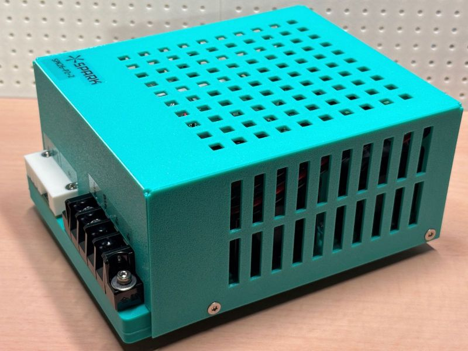

# Pulser Board

🚧 Under Construction 🚧

Open-source EDM module.

Explicitly designed for plunge EDM.
But probably will work for wire EDM too.

Created for https://github.com/xy-kasumi/Spark project.

## Capability (V2)

* 10A max pulse (see [module spec](./docs/pulser.md) for details)
* Designed for reliablity and modular testability (especially stress testing)

Assembly
* PCB (`pcb/` JLCPCB friendly KiCad files (all manufacturable using "Economical PCBA" process))
  * ctrl-r2
  * hv-r4
  * hc-r3
* firmware (ATtiny1616), for `ctrl` and `hv`
* enclosure: 3D print data in `assy`
* needs a few other parts (12V fans & heatsinks)

# Legacy

There was V1 (repo `PULSER-*` tags).
It was "feature-complete", but lacked reliability & testability.
