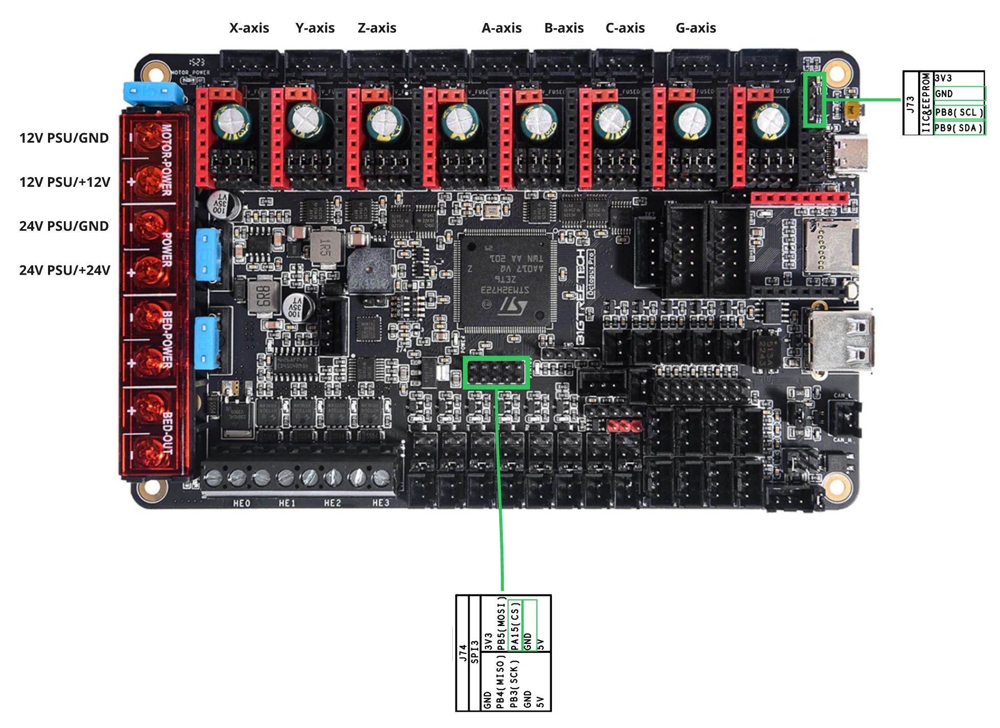

# Using Octopus Pro board for main controller

This doc explain wiring & firmware setup for using Octopus Pro board.

Necessary hardware:
* [BIGTREE TECH Octopus Pro (H273, V1.1) Board](https://biqu.equipment/products/bigtreetech-octopus-pro-v1-0-chip-f446) x1
  * MCU: STM32H723
  * [user guide](https://github.com/bigtreetech/BIGTREETECH-OCTOPUS-Pro/blob/master/BTT_Octopus_pro_EN.pdf)
  * [circuit schematics](https://github.com/bigtreetech/BIGTREETECH-OCTOPUS-Pro/blob/master/Hardware/BIGTREETECH%20Octopus%20Pro%20V1.1-sch.pdf)
  * [pins](https://github.com/bigtreetech/BIGTREETECH-OCTOPUS-Pro/blob/master/Hardware/BIGTREETECH%20Octopus%20Pro%20-%20PIN.pdf)
* TMC2209 stepper drivers x7

## Wiring



Power Input

* MOTOR_POWER: +12V PSU
* MB_POWER: +24V PSU
* BED_POWER: N/C

Disable USB-power and use PSU power by removing J68 jumper.


Stepper Motor

* Motor DIP
  * Comm mode: Set all 8 to "UART Mode"
  * Power: Use "Motor Power"
* Motor board: Insert TMC2209 boards (x7) in motor 0~6.
* Motor 0,1,2,3,4,5: X,Y,Z,A,B,C respectively
* Motor 6: Wire feeder

Other DIP

* MCU Power Jumper: Remove (Use MB_POWER insterad of USB power)

PULSER Connection
* SCL, SDA (J73, 3.3V, shared with an EEPROM. Pulled-up by 4.7k)
  * SCL: PB8, SDA: PB9
  * J73: 3.3V, GND, SCL, SDA
* GATE (J74-pin6, 3.3V)
  * SPI3_NSS: PA15
  * J74: pin6: SPI3_NSS, pin8: GND


## Firmware build environment
You need VSCode with PlatformIO extension.

1. Clone https://github.com/xy-kasumi/Spark-grblHAL and open the top-level folder in VSCode.
2. Click PlatformIO icon in the left sidebar. In "Project Tasks", you'll find "btt_octopus_pro_h723_tmc2209_spark" target.
3. Click "General > Build" to compile, "General > Upload" to write the firmware via USB.
    * When you modify platform.ini, it takes a few seconds for the menu to refresh.

## Firmware flashing

Setup
* Connect the board to PC via USB-C cable (for firmware writing via DFU)
* Prepare serial connection between the board and the host
    * Connect the board to RasPi Probe (or any other serial probe) TX2(PD5): board->host
    * Open serial console (e.g. TeraTerm) and set baudrate to 115200.

1. Put jumper to J75 (BOOT0) while the board is OFF.
2. Turn on the power and connect to PC via USB-C.
3. Run "Upload" in PlatformIO. Comfirm the operation status ended with "SUCCESS".
4. Power off the board and remove the jumper from J75 (BOOT0).
5. Power on the board. After about 5 seconds, you should see a few lines starting with `GrblHAL 1.1f ['$' or '$HELP' for help]` in the serial console.


See errors.c for error codes.

Quick test
```
$14=7 (disable "Start", "Hold", "Reset" by flipping them)
$X (unlock alarms)
$J=G91 X50 F100 (move X motor for 30 seconds)
```


### TBD

HE0~3 (24V = MB_POWER)
* Has flywheel diodes
  * can be used for pump control


## Firmware preparation

## Firmware update
