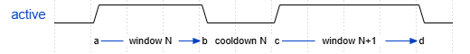
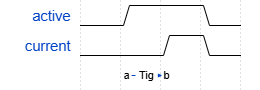
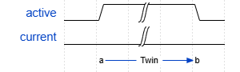
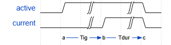
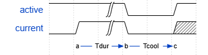

# Operation Model

When the device is running,
device activates in consecutive "windows".

Each window is categorized into exactly 3 types.
Cooldown after window is determined by the type.

note: when device stops, window is immediately closed regardless of its type.

## Short Window

When current started flowing too quickly (`Tig <= T_IG_SHORT`),
it's considered as a "short pulse", and window quickly terminates.

Cooldown will be `CD_SHORT`.

## Open Window

When current doesn't start flowing after wait time `Twin = T_IG_MAX`,
it's considered as an "open".

## Good Window

When current starts flowing at normal ignition delay `T_IG_SHORT <= Tig < T_IG_MAX`,
it's considered as an "good pulse", and active is held for pulse duration `Tdur`.

Since window duration of good pulse is determined by `Tig + Tdur`,
it can exceed `T_IG_MAX`.

Cooldown will be `max(CD_GOOD, cool_duty)`.

`cool_duty` is determined to satisfy `pulse_dur / (pulse_dur + cool_duty)` = `max_duty` config.

## Parameters

Ignition thresholds

* `T_IG_SHORT = 5us`
* `T_IG_MAX = 500us`

Cooldowns

* `CD_GOOD = 15us`: experimentally determined min value to de-arc properly
* `CD_SHORT = 200us`: has room to optimize. too short risks heatup due to de-arc failure
* `CD_OPEN = 500us`: big = less electrolysis but slower response
