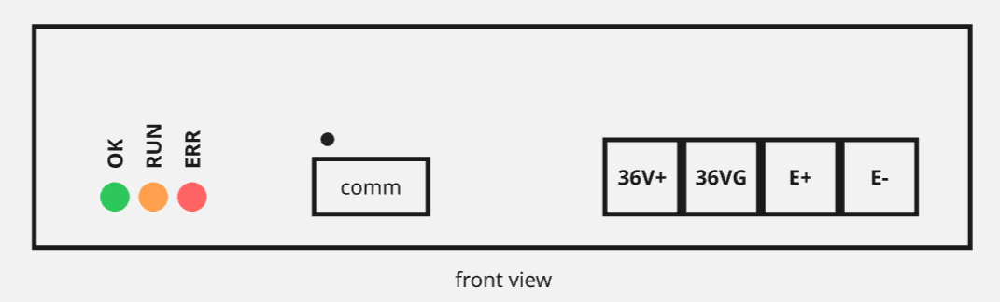

# Pulser V2

Features
* Iso-pulse control
* Max 10A pulse current
* Isolated I2C control & feedback interface

See [operation model](./operation.md) for how output works.

## Interface

### Indicators

* OK (green): indicates succesful boot up of the module
* RUN (amber): indicates output is enabled
  * Warning: OFF does NOT means output is safe to touch (might still be charged due to residual capacity)
* ERR (red): indicates fault

### Comm

XH 3 pin, I2C Fast Mode Plus (5V logic)
* 1:SDA 2:SCL 3:GND

Comm pins are isolated from power terminals.

See [I2C Register Map](./i2c-registers.md) for control.

### Power

Terminal Block
* 36V+, 36VG, E+, E-

note: E- and 36VG are internally connected.

## Mounting

* Dimensions: TBD
* Weight: TBD

Can mount to DIN rail.
