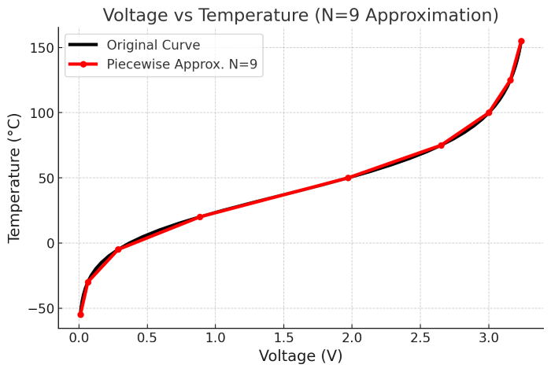

# CTRL-MINI-ED PCB Spec / Cheatsheet for Firmware Developer

This document specifies the PCB hardware interface needed for firmware development,
to meet the requirements defined in [user-README-CTRL-MINI-ED.md](user-README-CTRL-MINI-ED.md).

## uC Overview

uC is Raspberry Pi Pico 2 board.
* [Pico 2 board datasheet](https://datasheets.raspberrypi.com/pico/pico-2-datasheet.pdf)
* [RP2350 chip datasheet](https://datasheets.raspberrypi.com/rp2350/rp2350-datasheet.pdf)

uC operating environment
* 5V 1A powered, regulated down from 36V main power
* System clock: 150 MHz
* Firmware write via 3-pin QI connector SWD interface

## uC Connections

|Pin | Pin Feature | Connected to | Note |
|----|-------------|--------------|------|
|GP0 | I2C0 SDA    | I2C_SDA | to host; pulled up to 3.3V by 10kΩ on PCB |
|GP1 | I2C0 SCL    | I2C_SCL | to host; pulled up to 3.3V by 10kΩ on PCB |
|GP2 | GPIO (IN)   | GATE    | to host; direct |
|GP3 | GPIO (OUT)  | DETECT  | to host; direct |
|GP4 | GPIO (OUT)  | LED_STATUS | white LED, digital H = ON |
|GP5 | GPIO (OUT)  | LED_POWER  | red, digital H = ON |
|GP6 | -           | N/C | |
|GP7 | -           | N/C | |
|GP8 | GPIO (OUT)  | MUX_POL = POL | Relay gate drive. OFF: COM(TOOL)=-,VO_AUX=+, ON: COM(TOOL)=+, VO_AUX=- |
|GP9 | GPIO (OUT)  | MUX_WG = SEL | Relay gate drive. OFF: V0(WORK)=ON, ON: V1(GRINDER)=ON |
|GP10| GPIO (OUT)  | MUX_EN = EN | Relay gate drive. OFF: cut off driver, ON: connect driver |
|GP11| -           | N/C | |
|GP12| -           | N/C | |
|GP13| -           | N/C | |
|GP14| -           | N/C | |
|GP15| -           | N/C | |
|GP16| GPIO (IN)   | CURR_TRIGGER | 3.3V output from Comparator U5 |
|GP17| -           | N/C | |
|GP18| PWM or PIO (OUT)| CURR_GATE_PWM | analog filter; see below |
|GP19| -           | N/C | |
|GP20| PWM (OUT)    | CURR_THRESH_PWM | analog filter; see below |
|GP21| -           | N/C | |
|GP22| -           | N/C | |
|GP26| ADC0        | TEMP_HS | Thermistor - resistor voltage divider |
|GP27| -           | N/C | |
|GP28| -           | N/C | |

* N/C: No Connection

### Pulse generator (CURR_GATE_PWM, CURR_THRESH_PWM, DETECT)
Main MOSFET current flow
```
100V|36V --(E+)-- discharge gap --(E-)-- drain:MOSFET:source --(FB)-- 220mΩ(±5%) --- GND
```

Voltage at FB is used for current feedback control of MOSFET driving, and also for current detection.

| ΔIp or Ip | FB | GATE | Approx |
|-----------|----|------|--------|
| ΔIp = 100mA | ΔFB = 22mV (min: 21mV, max: 23mV) | ΔGATE = 37mV | 1/89 x 3.3V |
| Ip = 1A | FB = 0.22V (min: 0.21V, max: 0.23V) | GATE = 0.37V | 10/89 x 3.3V |
| Ip = 8A | FB = 1.76V (min: 1.67V, max: 1.85V) | GATE = 2.98V | 80/89 x 3.3V |

#### Current / voltage control
```
CURR_GATE_PWM --> gate-filter --(CURR_GATE)--> feedback-controlled MOSFET
CURR_THRESH_PWM --> thresh-filter --> -:voltage comparator
CURR_DETECT <-- voltage comparator:+ <-- FB filter --- FB
```

#### Gate filter
```
CURR_GATE_PWM (3.3V digital) --> 59% volt divider (Z=278Ω) --> 10uH --(pull down via 10nF) --> +:controller opAmp
```

This forms 2nd-order LPF with Fc=500kHz.
Simulation shows that
* 1us rise time for step input
* 2MHz PWM yields ripple of up to 5% of full scale (0.17V; corresponds to 750mA in Ip)
  * 2MHz PWM means 75 cycles (sys clock = 150MHz)
* allows room for current-shaping in the future

To achieve more accurate current control, pre-computed delta-sigma pattern table and PIO should be used.

#### Thresh filter
```
CURR_THRESH_PWM (3.3V digital) --> 10kΩ --(pull down via 10nF) --> -:voltage comparator
```
1st order LPF with Fc=1.6kHz.
1MHz PWM should yield accurate enough analog signal.

#### FB filter
FB signal goes through 2nd order LPF with Fc=1MHz to suppress noise.
This might introduce latency of 1us, but there's nothing uC can do.


### Relays (MUX_EN, MUX_POL, MUX_WG)
```
uC pin --- 1kΩ --(pull down via 47kΩ)-- gate:MOSFET
+12V --- relay coil (+ flywheel diode) -- drain:MOSFET:source --- GND
```

MOSFET gate has ringing-limiting in-line resistor (1k), and pull-down (47k).

Thus, when uC is not iniailized (high-Z GPIO), relay is OFF. uC also doesn't need to pull-down.

MOSFET: Vishay Si2304DDS
* [datasheet](https://www.lcsc.com/datasheet/lcsc_datasheet_2410121816_Vishay-Intertech-SI2304DDS-T1-GE3_C56372.pdf)
* Full-turn on around Vgs~3V

Relay: Omron G2RL-24 DC12
* [datasheet](https://omronfs.omron.com/en_US/ecb/products/pdf/en-g2rl.pdf)
* 2-pole (DPDT; 2c), sealed, 12V coil
* coil current 33mA, 12V
* turn on time: 15ms max
* turn off time: 5ms max
* rated switching load: 8A @ 30VDC (durability: 30K operations)
* rated carry current: 8A @ 70℃
* contact resistance: 100mΩ max


### Temperature sensor (TEMP_HS)
connection: 3.3V --- thermistor --(TEMP_HS)-- 47k --- GND

thermistor: 100kΩ NTC thermistor
* EPCOSB57861S0104F040
* R(T=25℃): 100kΩ±1%
* B-value: 4540K±1%
* [datasheet](https://docs.rs-online.com/838f/0900766b815ec91a.pdf)

This graph/table shows relationship within 5℃ accuracy.



TEMP_HS(V) | Temp(°C)
-----|-----
0.29 | -5
0.89 | 20
1.97 | 50
2.65 | 75
3.01 | 100
3.16 | 125

Outside this range, firmware should refuse to run (show error) until reset.

Thermistor is inserted to heatsink with silicon heat paste.

Heasink has MOSFET (Q4), resistor (R17), OR-diode (D6).
They're pretty heat resistant. However, it's better to think 60℃ or close as max allowed temp for heatsink.
