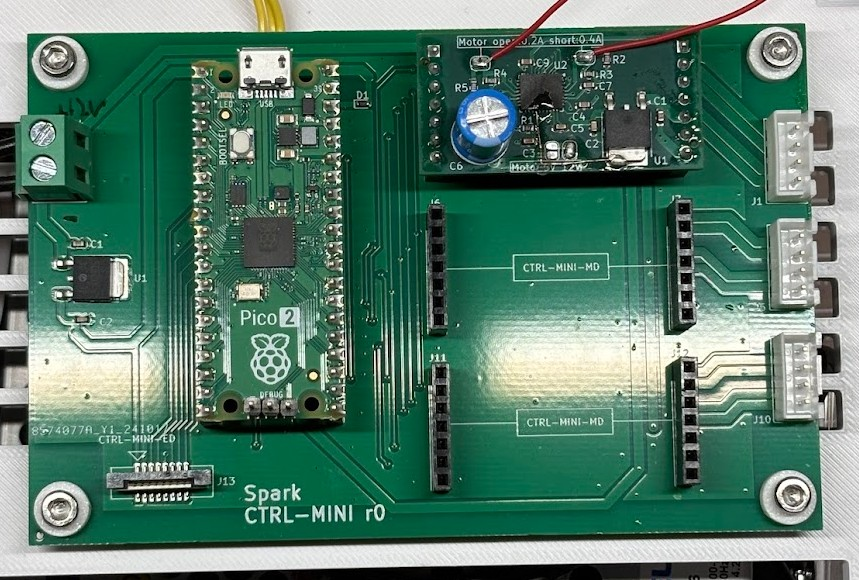

# CORE (r0) User Manual

This doc is for users of the CORE board.
It serves as both a datasheet and an operating manual.

## Overview

CORE is the main board of a Spark machine.
In the current prototype phase, it serves as an experimental hub.
Major revisions are expected in future iterations.

It features the following functionality:
- Terminal-like interface for human operator via RasPi probe
- 3-axis bipolar stepper motor driver with swappable child boards (STPDRV)
  - 12V, 0.4-ish A per phase
  - Features Trinamic TMC2130 driver with 1/256 microstepping capability
- Connectivity to PULSER board

Note: The architectural relationship between CORE and PULSER (whether as a sub-component or separate board) is TBD. This document treats it as a separate board.

### Power Supply

Screw terminal on the left side:
- Input: 12VDC
- Current: 2A minimum recommended
  - 1A minimum if using reduced motor current
  - Higher current ratings are OK

### Connections

Right edge: Motors
- 3x XH connectors
  - Pin configuration (top to bottom):
    1: A1
    2: A2
    3: B1
    4: B2

Bottom edge: PULSER connection
- Upright connector for FFC (Flat Flexible Cable)
  - Type-A, pitch 1mm, 8 pins
  - Terminal thickness: 0.3mm

Top edge: RasPi Probe (Serial Communication)
- QI female 3-pin connector
  1: TX
  2: RX
  3: GND

### Mechanical
Reference orientation: "Spark" text on board facing up

**General**
* Outer dimensions: 115mm (width) x 75mm (height) x 25mm (depth)
* Mass: to-be-measured

**Mounting**
Board dimensions: 115mm (width) x 75mm (height)
- 4x mounting holes:
  - Coordinates: (5mm, 5mm), (5mm, 70mm), (110mm, 5mm), (110mm, 70mm)
  - Hole diameter: 3.3mm
  - Clearance for screw head/spacer: 8mm diameter
  - Mounting areas are electrically isolated

## Terminal Interface

Connect the RasPi probe's serial port to the 3-pin QI connector.
Use any terminal emulator software on the host computer.

Required configuration:
- Baud rate: 115200

Recommended configuration:
- Line ending: CR (for both TX/RX)
- Local echo: ON

Interface behavior:
- Commands are single-line only (no multi-line support)
- Input control:
  - `Ctrl-C` or `Ctrl-K`: Cancel current command
  - Other control keys are not supported (backspace, arrows, delete)

### High-Level Commands

#### `status`
* **Description:** Prints the status of the system.

#### `edparam <duration_us> <duty> <current_ma>`
* **Description:** Configures pulse duration, duty factor, current. Will affect `drill` command.
* **Parameters:**
  * `duration_us`: integer, pulse duration in microseconds (range: 5 to 10000)
  * `duty`: integer, max duty ratio in percent (range: 1 to 50)
  * `current_ma`: integer, current in mA (range: 100 to 8000). Will be rounded down to possible value.

#### `move <board_ix> <distance>`
* **Description:** Moves the specified board by a given distance (in millimeters).
* **Parameters:**
  * `board_ix`: 0, 1, or 2
  * `distance`: float (in mm)

#### `find <board_ix> <distance>`
* **Description:** Moves up to a specified distance or until the electrode touches the work.  
  Uses a hot electrode scan and may cause slight damage to the work.
* **Parameters:**
  * `board_ix`: 0, 1, or 2
  * `distance`: float (in mm)

#### `drill <board_ix> <distance>`
* **Description:** Drills by a specified distance. Actual drill depth may be less due to tool wear.
* **Parameters:**
  * `board_ix`: 0, 1, or 2
  * `distance`: float (in mm)

### Motor Driver (MD) Commands

#### `step <board_ix> <step> <wait>`
* **Description:** Steps one motor in one direction at a constant speed.
* **Parameters:**
  * `board_ix`: 0, 1, or 2
  * `step`: integer (negative or positive), in microsteps
  * `wait`: integer, wait time after each microstep, in microseconds

#### `home <board_ix> <direction> <timeout_ms>`
* **Description:** Moves the motor to the home position (where it stalls).
* **Parameters:**
  * `board_ix`: 0, 1, or 2
  * `direction`: `-` or `+`
  * `timeout_ms`: integer, timeout in milliseconds

#### `regread <board_id> <addr>`
* **Description:** Reads a register from peripheral boards.
* **Parameters:**
  * `board_id`: 0, 1, 2, E
  * `addr`: hexadecimal value from `00` to `7f`

### Low-Level Commands

#### `regwrite <board_id> <addr> <data>`
* **Description:** Writes to a register on the peripheral boards.
* **Parameters:**
  * `board_id`: 0, 1, 2, E
  * `addr`: hexadecimal value from `00` to `7f`
  * `data`: hexadecimal, 1-byte for E, 4-byte for 0,1,2
* **Examples:**
  * `regwrite E 02 01`
  * `regwrite 0 10 1f10`
