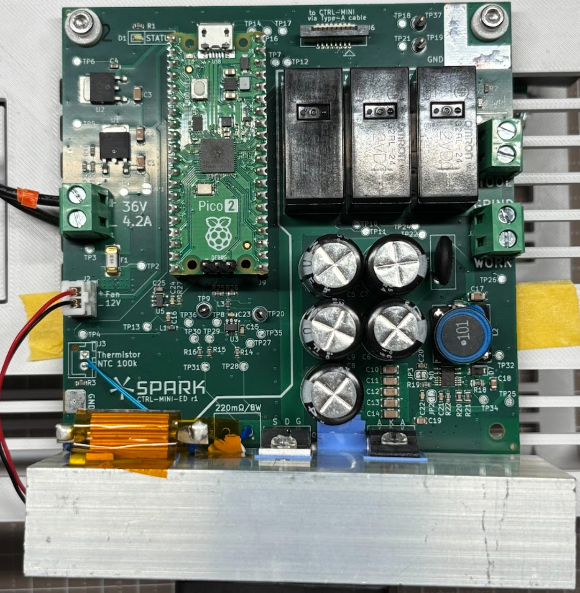
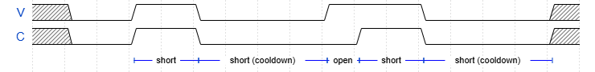
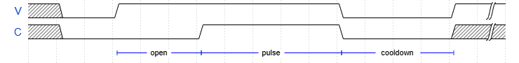

# PULSER (r1) User Manual

This doc is for users of the PULSER board.
It basically serves as both a datasheet and an operating manual.

## ⚠️ Safety warning ⚠️
Improper use of PULSER may cause death, fire, or damage to nearby devices.

## Overview

PULSER is an EDM discharge board, controllable via I2C and digital IOs.

* Max pulse current: 8A (at duty factor=50%)
* Open voltage: 100V
* 5 dynamic polarity configurations
  * (Tool+, Work-), (Tool-, Work+)
  * (Tool+, Grinder-), (Tool-, Grinder+)
  * Disconnected
* Continuous pulse operation
* Pulse statistics readout via I2C for position control
* Temperature monitoring via I2C

### Power Supply
Screw terminal on the left side
* DC 36V, 4.2A minimum

If the power supply is below 4.2 A, the microcontroller might reset accidentally at high-power setting.
Above 4.2 A should be fine, but too much output (e.g. 10 A) will increase the damage in case of firmware bug.

### Indicators

* Status (white) LED: ON if OK. Blinks if error. OFF means hardware or firmware failure.
* Power (red) LED: Indicates that electrodes are potentially energized. Blinks if error.

Even after sudden power failure, electrodes should be in high-impedance state if the Power (red) LED is OFF.
When the board enters an error state, the only way to recover is through a power reset.

### Connections

Control Connector:
* Upright connector for FFC (Flat Flexible Cable)
  * Type-A, pitch 1mm, 8 pins, terminal thickness 0.3mm

Electrodes:
* three screw-terminals on the right side ("Wire", "Grind", "Tool" marking on the PCB)

### Mechanical & Thermal
* Listed values are board with heatsink and fan
* "height", "width" etc. is based on "Spark" logo on the board

**General**
* Outer dimensions: 135mm (width) x 105mm (height) x 50mm (depth)
* Mass: 240g

**Mounting**
Board dimensions: 100mm (width) x 100mm (height)
* 4 mounting holes at (5mm, 5mm), (5mm, 95mm), (95mm, 5mm), (95mm, 95mm)
* Hole dia: 3.3mm, dia available for screw head, spacer etc: 6.5mm
  * available area is either isolated or GND

**Thermal**
* Max heat generation: 75W
  * Ensure adequate airflow at the bottom of the PCB for proper fan operation.

## Controller Interface

PULSER is designed to be safe (de-energized) to be turned on with "Control Connector" disconnected.

### Physical layer
"Control Connector" pinout (at **host-side**. See note.):
1. Don't Connect
2. GND
3. Don't Connect
4. I2C SDA
5. Don't Connect
6. I2C SCL
7. GATE
8. Don't Connect

Note: Type-A (terminals on same-side) means cross-cable. Thus, pinout at host and PULSER board is flipped.

* I2C SDA/SCL: 3.3V I/O. Standard Mode (~400kHz). Pulled-up in PULSER board.
* GATE: 3.3V digital input

### I2C layer

* Device Address: 0x3B
* Speed: Fast Mode (~400kHz clock)

Within the device, there are registers with 1-byte address and 1-byte data.
Write command writes to a single register, Read command read from a single register.

They share an internal pointer. Reading or writing register will auto-increment the pointer.

**Write**
* M: START
* M: Device Addr (7bit; 0x3B) + Write flag (1bit; 0)
* S: ACK
* M: Register Addr (8bit)
* S: ACK
* M: Data (8bit)
* S: ACK
* M: STOP

This also sets the internal pointer to Register Addr.

**Read**
(write pointer)
* M: START
* M: Device Addr (7bit; 0x3B) + Write flag (1bit; 1)
* S: ACK
* M: Register Addr (8bit)
* S: ACK
(read data from pointer)
* M: Repeated START
* M: Device Addr (7bit; 0x3B) + Read flag (1bit; 1)
* S: Data (8bit)
* M: NACK
* M: STOP

**Multi-byte read**
(write pointer)
* M: START
* M: Device Addr (7bit; 0x3B) + Write flag (1bit; 1)
* S: ACK
* M: Register Addr (8bit)
* S: ACK
(read data from pointer)
* M: Repeated START
* M: Device Addr (7bit; 0x3B) + Read flag (1bit; 1)
* S: Data 0 (8bit)
* M: ACK
* S: Data 1 (8bit)
* M: ACK
* ...
* S: Data N-1 (8bit)
* M: NACK
* M: STOP

(M: master, S: slave)

## Typical usecases

### Simplest usecase (not practical but good for initial testing)

1. Host configures POLARITY
2. Host sets GATE to HIGH

In this case, host does not configure pulses or monitor anything.
The device still operates with reasonable default values.
Default values are not max-power for safety reasons.

### Optimal usecase

1. Host configures PULSE_CURRENT, PULSE_DUR, MAX_DUTY, POLARITY
2. Host sets GATE to HIGH
3. Host polls (100Hz ~ 1 kHz) CHK_N_PULSE~R_OPEN registers to control gap distance

In this case, host extensively monitor discharge statistics.
In EDM, gap distance should be controled in closed-loop (typically 10um~100um)
The distance should be large enough to avoid too much shorts,
and small enough to reduce average ignition time (more time discharging).

There is a constraint for combinations of pulse time, pulse current, and duty factor.
See the "Pulse Shaping" section for details.

## Logical layer

### GATE

When GATE is LOW, discharge current will be suppressed.
When changing to LOW, ongoing discharge will be also terminated within 5us.

When POLARITY is not OFF and GATE is HIGH, electrodes are fully energized (100V),
and will wait for discharge to happen.

If the gap is too big, no discharge will happen.
You can see this via CHK_N_PULSE being 0 or R_OPEN being close to 1.0.

If the gap is too small, gap will short-circuit.
In this case, PULSER quickly shuts down the current and periodically checks until the gap is not short-circuited.
You can see this via R_SHORT having large (> 0.5) value.

If the gap distance is ok, discharge will happen after random time (called *ignition time*, Tig).
Tig typically ranges from 10μs to 500μs, and becomes shorter if the gap is narrower.

Safety note: electrodes are **high-voltage even when GATE is LOW**

Setting GATE to LOW merely means turning down the current close to 0.
However, open voltage of 100V is still present on the electrodes,
and the driver will allow more than 10mA current to flow, which is enough to kill you.

To actually turn them off completely, you need to set POLARITY to OFF.

### Control Registers
| Address | Register      | Access      | Resets to | Description |
|---------|---------------|-------------|-----------|-------------|
| 0x01    | POLARITY      | RW          | 0         | 0: OFF, 1~4: energize with certain polarity. |
| 0x02    | PULSE_CURRENT | RW          | 10        | pulse current in 100mA step. 1 (100mA) ~ 80 (8A) is allowed. |
| 0x03    | TEMPERATURE   | R           | N/A       | current heatsink temperature in ℃. 80 means 80℃. 255 means temp reading is unavailable due to severe issue. |
| 0x04    | PULSE_DUR     | RW          | 50        | pulse duration in 10 us unit. 5 (50us) ~ 100 (1000us) is allowed. Default is 500us. |
| 0x05    | MAX_DUTY      | RW          | 25        | Maximum duty factor allowed in percent. 1~95 is allowed. Default is 25%. |
| 0x10    | CKP_N_PULSE   | R (special) | N/A       | Number of pulse started in the interval. Reading this register creates checkpoint. |
| 0x11    | T_IGNITION    | R           | N/A       | average ignition time in the interval. Unit of 5us. 1:5us, 254:1270us, 255:invalid |
| 0x12    | T_IGNITION_SD | R           | N/A       | standard deviation of ignition time in the interval. Unit of 5us. 0:0us, 254:1270us, 255:invalid |
| 0x13    | R_PULSE       | R           | N/A       | Ratio of duration spent discharging in the interval. Values from [0.0, 1.0], calculated as R_PULSE/255 |
| 0x14    | R_SHORT       | R           | N/A       | Ratio of duration spent shorted and not discharging in the interval. Values from [0.0, 1.0], calculated as R_SHORT/255 |
| 0x15    | R_OPEN        | R           | N/A       | Ratio of duration spent waiting for discharge to happen in the interval. Values from [0.0, 1.0], calculated as R_OPEN/255 |

Register access:
* RW: read-write
* R: read-only

Invalid value writes are:
* set to safe default such as OFF (e.g. POLARITY)
* set to nearest valid value (e.g. PULSE_CURRENT)
* ignored for read-only or unused registers (e.g. TEMPERATURE)

### Checkpointed read
In normal operation mode, host will poll discharge statistics.
For the host to not miss any data because of I2C latency,
the registers are double-buffered.

Reading CKP_N_PULSE register "flips" the buffer.
N_PULSE value indicates number of pulse in previous interval.
IGT_H~R_OPEN also shows values in previous interval.

This ensures host will not miss any pulse count as long as they're polling fast enough to not allow overflow.

When N_PULSE overflows, it will stay in 255.
When N_PULSE Is 255, IGT_H / IGT_L will still indicates the average value in previous interval,
but they will be weighted by recency.

R_PULSE, R_SHORT, R_OPEN will be accurate even if the polling duration is long.
However, after 4300 seconds, measurements won't be accurate.

Reading CKP_N_PULSE register resets the internal counter and recovers the accuracy.

### Ignition time statistics (T_IGNITION, T_IGNITION_SD)

They're calculated from the pulse samples in the interval.
So, their samples are CKP_N_PULSE usually.

However, the first pulse long open-duration is NOT included in the sample,
as Tig cannot be extracted from that case.

Thus, T_IGNITION & T_IGNITION_SD will can be invalid even when CKP_N_PULSE > 0.

### Time measurement

Time can be divided into these categories.
* operating
  * pulse
  * short
  * open
  * cooldown
* configuring (applying POL or pulse parameter changes)

And then,
* R_PULSE = pulse / operating
* R_SHORT = short / operating
* R_OPEN = open / operating

| V | C | Time |
|---|---|------|
| H | H | Short or Pulse |
| H | L | Open |
| L | L | Short or Cooldown |

(V: voltage, C: current)

#### Example: Repeated short

When short (C rises too quickly when V rises), V is shutdown quickly to prevent arc welding.
To stabilize the gap, V is kept off for some fixed time, short (cooldown). This still counts as "short".

Even when gap is short, C might not rise immediately due to inductance or measurement latency.
These spans will be counted as "open".

This case won't affect pulse count or average ignition time.

#### Example: Normal pulsing

For normal pulse condition, C takes more time ("ignition time") to rise.
When this happens, V is kept high for pulse duration (PULSE_DUR), then turns off.

After pulse is ended, V is kept off for cooldown to satisfy both of the following conditions:
* pulse / (pulse + cooldown) <= MAX_DUTY
* cooldown >= a few us (internal fixed threshold): to prevent always-on case

When succesful pulse has started, pulse count is incremented.
Open time can be very long if the gap is wide.
To avoid skewing ignition time statistics, ignition time is capped at 1000us.

### Timing relation between I2C and GATE

Writes to POLARITY & PULSE_CURRENT immediately updates the register.
However, when register is changed during GATE is HIGH,
* change will take effect from the next pulse
* actual EDM driver will be suppressed for 1ms (PULSE_CURRENT change) and 20ms (POLARITY change)

As an exception to the delay above, setting POLARITY to OFF immediately shutdown EDM driver.

### POLARITY

* 0: OFF
* 1: TPWN (Tool+, Work-)
* 2: TNWP (Tool-, Work+)
* 3: TPGN (Tool+, Grinder-)
* 4: TNGP (Tool-, Grinder+)

### Pulse Shaping

The PULSER board driver is optimized for EDM. It uses a combination of:
* 100V low-capacity "ignition supply"
* 36V high-capacity "discharge supply"

This is possible because the gap voltage, once ignited, becomes about 20V (up to ~30V, depending on conditions).
This dual supply driver is power-efficient but produces unexpected behavior when connected to non-discharging loads.
