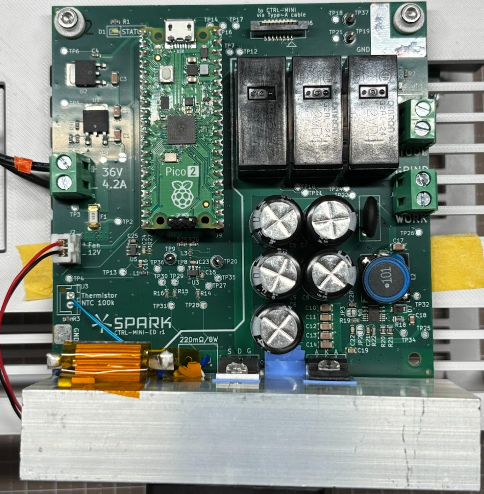
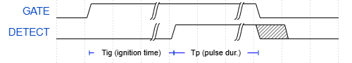

# CTRL-MINI-ED User Manual

This doc is for users of the CTRL-MINI-ED board.
Basically a datasheet + operating manual.

## ⚠️ Safety warning ⚠️
Improper use of CTRL-MINI-ED may cause death, fire, or damage to nearby devices.

## Overview

CTRL-MINI-ED is an EDM discharge board, controllable via digital IOs and I2C.

* Max pulse current: 8A (at duty factor=50%)
* Open voltage: 100V
* 5 dynamic polarity configurations
  * (Tool+, Work-), (Tool-, Work+)
  * (Tool+, Grinder-), (Tool-, Grinder+)
  * Disconnected
* Single-pulse discharge timing control, and pulse current detection via GATE/DETECT digital IOs
* Pulse current, detection threshold, polarity control, temperature monitoring via I2C

### Power Supply
Screw-terminal on the left side
* DC 36V, 4.2A minimum

If below 4.2A, uC might reset accidentally at high-power setting.
Above 4.2A should be fine, but too much output (e.g. 10A) will increase the damage in case of firmware bug.

### Indicators

* Status (white) LED: ON if OK. Blinks if error. OFF means hardware or firmware failure.
* Power (red) LED: indicates that electrodes are potentially energized

Even after sudden power failure, electrodes should be High-Z if power red is OFF.

### Connections

Control Connector:
* Upright connector for FFC (Flat Flexible Cable)
  * Type-A, pitch 1mm, 8 pins, terminal thickness 0.3mm

Electrodes:
* three screw-terminals on the right side ("Wire", "Grind", "Tool" marking on the PCB)

### Mechanical & Thermal
* Listed values are board with heatsink and fan
* "height", "width" etc. is based on "Spark" logo on the board

**General**
* Outer dimensions: 135mm (width) x 105mm (height) x 50mm (depth)
* Mass: 240g

**Mounting**
Board dimensions: 100mm (width) x 100mm (height)
* 4 mounting holes at (5mm, 5mm), (5mm, 95mm), (95mm, 5mm), (95mm, 95mm)
* Hole dia: 3.3mm, dia available for screw head, spacer etc: 6.5mm
  * available area is either isolated or GND

**Thermal**
* Max heat generation: 75W
  * Ensure adequate airflow at the bottom of the PCB for proper fan operation.

## Controller Interface

CTRL-MINI-ED is designed to be safe (de-energized) to be turned on with "Control Connector" disconnected.

### Physical layer
"Control Connector" pinout (at **host-side**. See note.):
1. Don't Connect
2. GND
3. Don't Connect
4. I2C SDA
5. Don't Connect
6. I2C SCL
7. GATE
8. DETECT

Note: Type-A (terminals on same-side) means cross-cable. Thus, pinout at host and ED board is flipped.

* I2C SDA/SCL: 3.3V I/O. Standard Mode (~100kHz). Pulled-up in ED board.
* GATE: 3.3V digital input
* DETECT: 3.3V digital output

### I2C layer

* Device Address: 0x3B
* Speed: Standard Mode (~100kHz clock)

Within the device, there are registers with 1-byte address and 1-byte data.
Write command writes to a single register, Read command read from a single register.

**Write**
* M: START
* M: Device Addr (7bit; 0x3B) + Write flag (1bit; 0)
* S: ACK
* M: Register Addr (8bit)
* S: ACK
* M: Data (8bit)
* S: NACK
* M: STOP

**Read**
* M: START
* M: Device Addr (7bit; 0x3B) + Read flag (1bit; 1)
* S: ACK
* M: Register Addr (8bit)
* S: ACK
* S: Data (8bit)
* M: NACK
* M: STOP

(M: master, S: slave)

### Logical layer

**GATE/DETECT**
Host can initiate a single pulse by setting GATE to HIGH.
If the discharge condition is good, discharge will happen after random Tig (ignition time).
Tig is inherently random, but typically 1us~500us, and shorter if the gap is narrower.

DETECT become HIGH whenever discharge current is detected.
The host is responsible for monitoring DETECT, and set GATE to LOW after desired pulse duration time.

Current detection threshold is auto-set to 25% of pulse current by ED board.

**Control Registers**
|Address| Register      | Access | Resets to | Description |
|-------|---------------|--------|-----------|-------------|
| 0x01  | POLARITY      | RW     | 0         | 0: OFF, 1~4: energize with certain polarity. |
| 0x02  | PULSE_CURRENT | RW     | 10        | pulse current in 100mA step. 1 (100mA) ~ 80 (8A) is allowed. |
| 0x03  | TEMPERATURE   | R      | N/A       | current heatsink temperature in ℃. 80 means 80℃. |

Register access:
* RW: read-write
* R: read-only

Invalid value writes are:
* set to safe default such as 0, OFF (e.g. POLARITY)
* set to nearest valid value (e.g. PULSE_CURRENT, DETECT_THRESH)
* ignored for read-only or unused registers

Change to PULSE_CURRENT takes up to 1ms to fully take effect.
Avoid turning on GATE during that period.

Actual drive current would reach specified current within 5us of write completion.
However, detection threshold change can take up to 1ms.
This means during or just before pulse,
* lowering PULSE_CURRENT: Rise of DETECT can be delayed by up to 1ms
* raising PULSE_CURRENT: Premature DETECT rise, due to increased noise sensitivity
