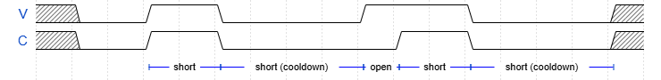
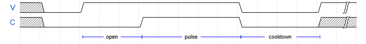

# PULSER (r4) User Manual

This doc is for users of the PULSER board.
It basically serves as both a datasheet and an operating manual.

## ⚠️ Safety warning ⚠️
Improper use of PULSER may cause death, fire, or damage to nearby devices.

## Overview

old

PULSER is an EDM discharge board, controllable via I2C.

Characteristics
* Ignition voltage: 100V
* Pulse current: 0.1A ~ 20A
* Pulse duration: 50us ~ 1000us

Flexible control via I2C:
* Pulse current, duration, max duty factor selection
* Polarity selection: tool positive, tool negative, disconnected
* Pulse statistics readout for EDM servo controller
* Board temperature monitoring
* Safety shutdown when host communication is disrupted

### Power Supply
Screw terminal on the left side
* DC 36V, 16A minimum (for discharge power)
* DC 12V, 2A minimum (for uC, fans, gate drivers)

### Indicators

* Status (white) LED: ON if OK. Blinks if error. OFF means hardware or firmware failure.
* Power (red) LED: Indicates that electrodes are potentially energized.

Even after sudden power failure, electrodes should be in high-impedance state if the Power (red) LED is OFF.
When the board enters an error state, the only way to recover is through a power reset.

### Connections

Control Connector:
* Upright connector for 3-pin JST-XH

Electrodes:
* two screw-terminals on the right side ("TOOL", "W/G" marking on the PCB)

### Mechanical & Thermal
* Listed values are board with heatsink and fan
* "height", "width" etc. is based on "Spark" logo on the board

**General**
* Outer dimensions: 150mm (width) x 100mm (height) x ? mm (depth)
* Mass: ? g

**Mounting**
Board dimensions: 150mm (width) x 100mm (height)
* 4 mounting holes at (5mm, 5mm), (5mm, 95mm), (145mm, 5mm), (145mm, 95mm)
* Hole dia: 3.3mm, dia available for screw head, spacer etc: 6.5mm
  * available area is either isolated or GND

**Thermal**
* Max heat generation: 25W
  * Ensure adequate airflow at the bottom of the PCB for proper fan operation.

## Controller Interface

PULSER is designed to be safe (de-energized) to be turned on with "Control Connector" disconnected.

### Physical layer
"Control Connector" pinout:
1. SDA
2. SCL
2. GND

* I2C SDA/SCL: 3.3V I/O. Standard Mode (~400kHz). Pulled-up in PULSER board.

### I2C layer

* Device Address: 0x3B
* Speed: Fast Mode (~400kHz clock)

Within the device, there are registers with 1-byte address and 1-byte data.
Write command writes to a single register, Read command read from a single register.

They share an internal pointer. Reading or writing register will auto-increment the pointer.

**Write**
* M: START
* M: Device Addr (7bit; 0x3B) + Write flag (1bit; 0)
* S: ACK
* M: Register Addr (8bit)
* S: ACK
* M: Data (8bit)
* S: ACK
* M: STOP

This also sets the internal pointer to Register Addr.

**Read**
(write pointer)
* M: START
* M: Device Addr (7bit; 0x3B) + Write flag (1bit; 1)
* S: ACK
* M: Register Addr (8bit)
* S: ACK
(read data from pointer)
* M: Repeated START
* M: Device Addr (7bit; 0x3B) + Read flag (1bit; 1)
* S: Data (8bit)
* M: NACK
* M: STOP

**Multi-byte read**
(write pointer)
* M: START
* M: Device Addr (7bit; 0x3B) + Write flag (1bit; 1)
* S: ACK
* M: Register Addr (8bit)
* S: ACK
(read data from pointer)
* M: Repeated START
* M: Device Addr (7bit; 0x3B) + Read flag (1bit; 1)
* S: Data 0 (8bit)
* M: ACK
* S: Data 1 (8bit)
* M: ACK
* ...
* S: Data N-1 (8bit)
* M: NACK
* M: STOP

(M: master, S: slave)

## Typical usecase

1. initialization: Host configures PULSE_CURRENT, PULSE_DUR, MAX_DUTY, POLARITY (1 or 2)
2. discharging: Host reads CKP_PS register periodically at 10Hz ~ 1 kHz
3. discharge end: Host write POLARITY=0 and stops polling CKP_PS

In EDM, gap distance between the electrodes should be adjusted to 10um~100um using closed-loop feedback control.
The distance should be large enough to avoid too much shorts, and small enough to reduce average ignition time (more time discharging).

Value from CKP_PS is suitable for this control.

## Logical layer

### Control Registers
| Address | Register      | Access      | Resets to   | Description |
|---------|---------------|-------------|-------------|-------------|
| 0x01    | POLARITY      | RW          | 0           | 0: OFF, 1: tool positive, 2: tool negative |
| 0x02    | PULSE_CURRENT | RW          | 10 (1A)     | Pulse current in 100mA step. 1 (100mA) ~ 200 (20A) is allowed. |
| 0x03    | TEMPERATURE   | R           | N/A         | Current heatsink temperature in ℃. 80 means 80℃. |
| 0x04    | PULSE_DUR     | RW          | 50 (500us)  | Pulse duration in 10 us unit. 5 (50us) ~ 100 (1000us) is allowed. |
| 0x05    | MAX_DUTY      | RW          | 25 (25%)    | Maximum duty factor allowed in percent. 1~95 is allowed. |
| 0x10    | CKP_PS        | R (special) | N/A         | Create checkpoint and reads pulse stats. High 4 bit is pulse rate, low 4 bits is short rate. See "checkpointed read" for details. |
| 0x80    | TEST          | RW          | 0           | 0: Normal operation. bit 0 (LSB) is set: Disable short detection. bit 1: Disable ignition wait. |

Register access:
* RW: read-write
* R: read-only

Invalid value writes are:
* set to safe default such as OFF (e.g. POLARITY)
* set to nearest valid value (e.g. PULSE_CURRENT)
* ignored for read-only or unused registers (e.g. TEMPERATURE)

### Checkpointed read & safety
Pulser maintains discharge statistics since last checkpoint.

Reading the CKP_PS register cause these two to happen atomically:
* returns the statistics from the last checkpoint and now, via I2C
* create new checkpoint and zeroes internal stats counters

Pulser only becomes active if and only if both are met:
* POLARITY != OFF
* CKP_PS was read within last 100ms

Thus, host must poll CKP_PS with more than 10Hz frequency.
This ensures that pulser de-energizes electrodes safely when I2C communication is disrupted by host or cable failure.

CKP_PS register consists of two values.
* higher 4 bits: R_PULSE (0~15)
* lower 4 bits: R_SHORT (0~15)

From R_PULSE and R_SHORT, host can calculate R_OPEN.

> R_OPEN = 15 - (R_PULSE + R_SHORT)
(The sum of R_PULSE & R_SHORT never exceeds 15.)

R_PULSE, R_SHORT, and R_OPEN represent time ratio between 0.0 (0/15) ~ 1.0 (15/15),
and they add up to 1.0.

At any point, pulser is one of 4 states.
* Active
  * Open: electrodes are energized but discharge was not happening
  * Short: electrodes are energized and short was happening
  * Pulse: electrodes are energized and pulse is happening
* Inactive: electrodes are not energized (POLARITY=OFF, last CKP_PS read was more than 100ms ago, cooling down to follow MAX_DUTY)

R_PULSE = (duration of "Pulse") / (duration of "Active"), etc.

Note that Inactive duration is not taken into account for the ratios. This makes the reading more consistent for different MAX_DUTY
(such as 70% for rough discharge, and 5% for finishing discharge).

### Configuration delay

Writes to POLARITY & PULSE_CURRENT immediately updates the register.
However, when register is changed during active,
* change will take effect from the next pulse
* actual EDM driver will be suppressed for 1ms (PULSE_CURRENT change) and 20ms (POLARITY change)

As an exception to the delay above, setting POLARITY to OFF immediately shutdown EDM driver.

### Pulse Shaping

The PULSER board driver is optimized for EDM. It switches two power supply:
* ignition supply: low-capacity, 100V constant-voltage
  * Created from 36V power line with Boost converter
* discharge supply: high-capacity, controllable constant-current
  * Created from 36V power line with Buck converter

This is possible because the gap voltage, once ignited, becomes about 20V (up to ~30V, depending on conditions).
This dual supply driver is power-efficient but produces unexpected behavior when connected to non-discharging loads.

| V | C | Time |
|---|---|------|
| H | H | Short or Pulse |
| H | L | Open |
| L | L | Short or Cooldown |

(V: voltage, C: current)

#### Example: Repeated short

When short (C rises too quickly when V rises), V is shutdown quickly to prevent arc welding.
To stabilize the gap, V is kept off for some fixed time, short (cooldown). This still counts as "short".

Even when gap is short, C might not rise immediately due to inductance or measurement latency.
These spans will be counted as "open".

This case won't affect pulse count or average ignition time.

#### Example: Normal pulsing

For normal pulse condition, C takes more time ("ignition time") to rise.
When this happens, V is kept high for pulse duration (PULSE_DUR), then turns off.

After pulse is ended, V is kept off for cooldown to satisfy both of the following conditions:
* pulse / (pulse + cooldown) <= MAX_DUTY
* cooldown >= a few us (internal fixed threshold): to prevent always-on case

When succesful pulse has started, pulse count is incremented.
Open time can be very long if the gap is wide.
To avoid skewing ignition time statistics, ignition time is capped at 1000us.
